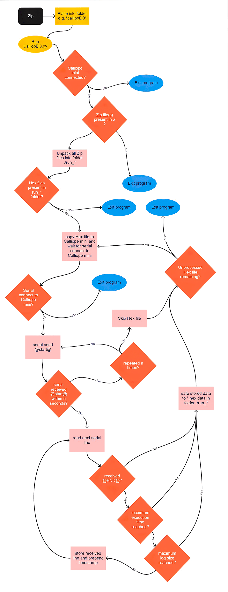
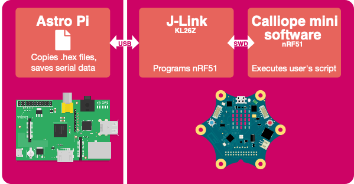

**CalliopEO**

[README](README.md) | ***[Program Description](ProgramDescription.md)*** | [Testcases](testcases/testcases.md)

# Program Description
## 1 Scope
This document provides a detailed overview of the program interactions between Astro Pi and the CALLIOPE MINI through USB connection (AP-PWR-CBL-1M (S/N 01 and 02)) and shows the individual software components that are used. It also features a system description of the software running on the Calliope mini.

### A.	List of Abbreviations

Abbreviation | .
---|---------
AD | Applicable Document
BMWi | Federal Ministry for Economics and Energy (Bundesministerium für Wirtschaft und Energie)
CE | Conformité Européenne
CO2	| Carbon dioxide
COG	| Centre of Gravity
COTS | Commercial of the Shelf
DC | Direct current
DLR | German Aerospace Center (Deutsches Zentrum für Luft- und Raumfahrt)
EMC	| Electromagnetic Combability 
ESA | European Space Agency
ESRP | European Safety Review Panel
FCC | Federal Communications Commission
FSDP | Flight Safety Data Package
LED | Light Emitting Diode
EPO | Education and Public Outreach
I2C | Inter-Integrated Circuit
IR | Infrared
ISS | International Space Station
NDIR | Non-Dispersive Infrared
PCB | Printed Circuit Board
RPM | Rotations per Minute
PSRP | Payload Safety Review Panel
RD | Reference Document
RF | Radio Frequency
RGB | Red Green Blue
SCC | Stress corrosion cracking
TLV | Threshold Limit Values
UHR | Unique Hazard Report
USB | Universal Serial Bus
USOC | User Support and Operations Centre
USOS | US Space Segment (on ISS)

## 2 Documents

### 2.1 Applicable Documents

 . | Document Name | Document Number | Issue | Date
---|---------------|-----------------|-------|------
[AD1] | ISS Safety Requirements Document | SSP 51721 | Rev. 0 | 2019-10-21
[AD2] | Safety Review Process | SSP 30599 | 
[AD3] | Product Assurance and Safety Requirements for ISS | ESA-HRE-IPL-RQ-0002 | 
[AD4] | ISS Pressurized Volume Hardware Common Interface Requirements Document | SSP 50835 | Rev. D | 2013-07-17
[AD5] | Product Assurance & Safety Requirements for CalliopEO | 

### 2.2 Reference Documents

 . | Document Name | Document Number | Issue | Date
---|---------------|-----------------|-------|------
[RD1] | CalliopEO / Experiment Requirement Document (ERD) | ESA-HRE-ERD-Calliope Mini in Space | Issue 1 / Revision 1 | 2021-05-07 / under review
[RD2] | European Astro Pi Challenge 2021-22 ERD | ESA-DGPES-ERD-AstroPi-Challenge-2021-22 | | Issue date TBC
[RD3] | Raspberry Pi Documentation – Power Supply [Link](https://www.raspberrypi.org/documentation/hardware/raspberrypi/power/README.md) | | Accessed: 2021-02-03
[RD4] | Mk2 Astro Pi FSDP | RPI-ASTROPI-MK2-FSDP-001 | Issue date TBC
[RD5] | ESA Small Payload ICD | Appendix BW (CalliopEO) | ESO-IT-ICD-0013-PIRN-0074 | Issue 1 | 2021-03-12


## 3 Introduction
To run the CalliopEO payload, the Calliope mini microcontroller inside CALLIOPE MINI will be connected to ESA’s Astro Pi IR. Besides powering the CALLIOPE MINI payload this USB connection will also provide the ability to copy Hex-files from ESA’s Astro Pi IR to the Calliope mini microcontroller and for the Calliope mini microcontroller to send back serial data to ESA’s Astro Pi IR for storage and downlink.

The programming runs whenever a new file package has been sent to the Astro Pi. If the latest program has been finished the Calliope mini sends a serial information to the Astro Pi. The serial communication from the Calliope mini to the Astro Pi features also a start and data information (only if data have to be recorded).

The interaction between the two devices is done with a single Python script called `CalliopEO.py`. 

The Python script facilitates an interaction between Astro Pi and the Calliope mini microcontroller board. If executed the script detects if a Calliope mini is attached to a USB port of the Astro Pi and determines the serial port to communicate with the Calliope mini. Any program(s) to be executed by the Calliope mini will need to be placed as zipped file(s) in the main directory where the script `CalliopEO.py` resides. If executed the script will search for all zip archives, unpack the Calliope mini program (HEX file) from the archive and flashes the Calliope mini with this program. After flashing the Calliope mini will reboot automatically and execute the program. In the main directory a sub-folder named `run_DDMMYY-HHMM` will be created. The HEX files flashed and executed on the Calliope mini will be copied to this folder along with any data sent back by the program (files will end with `.data`). The initial zip archive in the main folder is renamed (additional suffix `.done`) to exclude this file from being processed again. The `CalliopEO.py` script can collect data sent by the program on the Calliope mini via the USB serial port. Therefore prepare the Calliope mini program to wait for the string `@START@`. Then the Calliope mini program should respond by sending `@START@` back to the CalliopEO.py script and only after this sending the data. After sending the data the Calliope mini program should send the message `@END@`.
 

## 4 Software Flow Astro Pi to CALLIOPE MINI


Figure 5-24: Software Flow Diagram

## 5 Software Types

### 5.1 Overview 

Software for the Calliope mini consists of two main groups: software that runs on the Astro Pi and software that runs on the Calliope mini (target). Typically, a program is written on a host computer and then transferred directly to the Calliope mini over USB. In our case the software is transferred from the Astro Pi to the Calliope mini (except for an initial program that will be preinstalled on the Calliope mini). There are actually two chips on the Calliope mini one that is running the J-Link/DAPlink software entirely to facilitate the flashing (KL26Z) and one that actually runs the user’s code (nRF51).



Different types of software:     
- The master program (CalliopEO.py) is the Python programming that initiate the
communication from the Astro Pi.
- The initial Hex file that is running the main experiments from the CalliopEO. This Hex file will also be sent as the first batch to the Astro Pi. More info on this hex file can be found in a dedicated chapter below.
- Hex files that will be sent by students to run their experiments on the Calliope mini. The files will be sent in batches/sets of Hex files.
- The bootloader file. This file is already running on the interface chip of the Calliope mini and ensures USB and serial connection from and to the Calliope mini. This file is already installed on the hardware and there is no need to change it.

All Hex files will be checked and tested; the individual source of the program can be sent as a JavaScript file.
The bootloader of the Calliope mini can be delivered as source code directly from SEGGER, if needed.

#### 5.1.1 Device Abstraction Layer DAL

The Calliope mini runtime provides a Device Abstraction Layer (DAL) that is built using Arm Mbed. Lancaster University has written this runtime as part of its ongoing efforts to support the adoption of Computer Science in schools (see [here](https://tech.microbit.org/software/runtime/)). It provides a useful set of functions for higher level languages to consume and make programming the Calliope mini in C or C++ easier. Many of the ‘blocks’ you use in the visual editor are directly calling functions provided by the DAL. The Calliope mini runtime DAL is written in C/C++ and builds on the Arm Mbed HAL.

Key components of the Calliope mini DAL are:
* a scheduler that lets Calliope mini do more than one task at a time. An eventing system called the message bus that lets you write reactive code. It can inform your program when things happen on your Calliope.
* Device drivers representing the major hardware blocks on the Calliope mini including the LED display sensors and file system.
* Managed types that help keep programs safe from the complexities of memory management.

#### 5.1.2 Editor

[Microsoft MakeCode](https://www.microsoft.com/en-us/makecode/about) will be available to use as an editor to build the programs. The generated hex files contain the compiled hex part as well as an importable JavaScript part. We never use the compiled part of files which are not compiled by us. When we receive Hex files, we import them to a special version of MakeCode, check the code for unsupported parts and wrap the start and stop signals for the Python Script around. This way we make sure to know what code gets sent to the Calliope mini and are able to prove it line by line. The detailed review process of the students code is not in scope of this documentation.
The JavaScript file as an example can be found as an appendix (A.2).
     
#### 5.1.3 J-Link/DAPLink

The Calliope mini presents itself as a USB disk when it is connected over USB and can be programmed through this interface. Furthermore, no matter what code you run on your Calliope mini you can always put a new program on using the USB connection. This is made possible by having a separate ‘interface chip’ on the Calliope mini dedicated to USB connections programming and debugging. The Interface MCU is a Freescale KL26Z.The chip that developers’ code runs on and that all the peripherals are connected to is called the ‘target MCU’. The Target MCU is a Nordic Semiconductor nRF51822. Due to the number of pins on the Nordic Semiconductor chip only the uart TX and RX lines are connected between the interface MCU and the target MCU. This means that there is no hardware flow control possible. This means that at higher serial speeds (baud rates above 9600) the Calliope mini may drop characters being sent to it.

#### 5.1.4 Python Script
     
The Python 3 script will run on the current Astro Pi hardware.
However, the minimum dependencies are documented in [requirements.txt](requirements.txt).

The installation, execution and de-installation process is documented in the [Readme.md](README.md)

### 5.1.5 The initial HEX file (30sec-iss-sensors.hex)

The initial HEX file provided with the upload of CalliopEO to the ISS is named `30sec-iss-sensors.hex`. The HEX file can be found in [./testcases/testfiles/](testcases/testfiles) and the source of the program can be found [here](testcases/testfiles/30sec-iss-sensors.js). The program is primarily meant to perform System Validation Tests to ensure propper functionality of hardware and software also remotely from Ground.

To execute `30sec-iss-sensors.hex` execute the following steps from the main directory (`~/calliopEO`):

```
# Copy the ZIp archive containing the 30sec-iss-sensors.hex to the main diretory
cp testcases/testfiles/30sec-iss-sensors.zip .
# Execute the Python script
./CalliopEO.py
```

The program runs for 30 seconds (programmable via the variable `runMaxSeconds`) and can be used to test the sensors as well as the buttons of the CalliopEO. The program polls the sensors and button state every second (programmable via the variable `updatePeriod`). The polling of individual sensors can be disabled via boolean variables (example: `testSCD30 = false`).

If `runMaxSeconds` is set to zero, the program runs infinite.

Due to the time needed to poll every sensor/actuator and to output the result over the serial port do not set `updatePeriod` to values below ~ 300 ms. Values for `updatePeriod` lower than 1000 ms however can be used to set the CalliopEO into a burst mode e.g. for an electromagnetic compatibility test.

To create a modified version of a HEX program derived from `30sec-iss-sensors.hex` copy/paste the content of the JavaScript source file [`30sec-iss-sensors.js`](testcases/testfiles/30sec-iss-sensors.js) to the Microsoft Mikrocode editor, apply the necessary changes and export the corresponding HEX file using the functions in Makecode. Create a ZIP archive from this HEX file, place it
in the main diretory and execute `CalliopEO.py`.

According to the current availability of drivers for the Calliope and the availability of sensors/actuators present on the CalliopEO hardware (some parts had to be removed or deactivated due to ISS safety regulations) the following sensors/actuators are supported:

* CalliopEO onboard temperature sensor
* CalliopEO onboard light sensor
* BMX055 accelerometer (x, y, z, total)
* SCD30 temperature, humidity and CO2 concentration
* SI1145 IR intensity, light intensity and UV index
* TCS34725 red, green, blue and white color values
* State of CalliopEO buttons A and B (pressed/not pressed)
* Test of the CalliopEO 5x5 LED matrix. In every cycle one more LED is set on of off.

### 5.2. Data transmission

The Calliope mini comes preinstalled with the experiments, so that it immediately can send data once connected and the CalliopEO.py script is executed, but no .zip file is directly available. However, this program is also part of the first ones to be uploaded from the Astro Pi, to check if the connectivity does work. In this case the programs for the Columbus Module Position (COL1A2/A3) and Window Position (Node 1/2 Nadir Hatch Window or any available Nadir facing Window) will run respectively in the order of the experiments. After the experiments have been run, the data files (as seen in 5.1.1) should be sent back as soon as possible. 
The student experiments will be uploaded in the same way. Once programs that collect measurements have been run the data files (as seen in 5.1.1) should be send back as well.

## A. Appendices

- A.1 [Dokumentation of CalliopeEO Phyton Script](README.md)
- A.2 [Example JavaScript code of the preinstalled file on the Calliope mini](testcaes/testfiles/30sec-iss-sensors.js)
- A.3 [Example of saved Data file](testcaes/testfiles/30sec-iss-sensors.hex.data)
- A.4 [Minimum requirements](requirements.txt)
