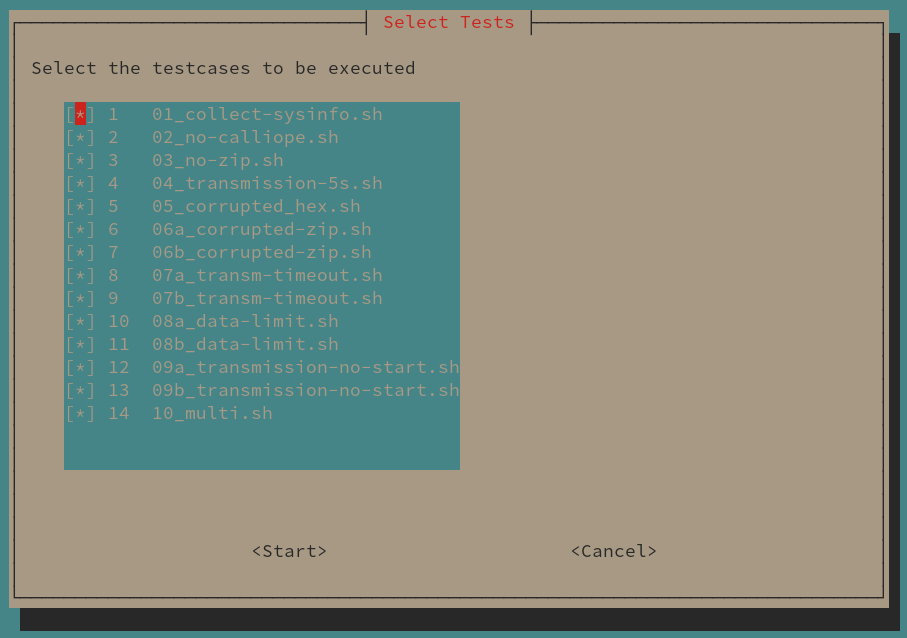

**CalliopEO**

***[README](README.md)*** | [Program Description](ProgramDescription.md) | [Testcases](testcases/testcases.md) | [Changelog](CHANGELOG.md)
# Readme

## Description
CalliopEO is a Python script to facilitate interaction between a Raspberry Pi microcomputer and a [Calliope Mini microcontroller board](https://calliope.cc/). If executed, the script detects, if a Calliope Mini is attached to a USB board of the Raspbery Pi and determins the serial port to communicate with the Calliope Mini.

The directory, in which the `CalliopEO.py` script is located is called the main directory. Place any program(s) to be executed by the Calliope Mini as zipped HEX file(s) in this main directory. If executed the script will search for all zip archives, unpack the Calliope Mini program (HEX file) from the archive and flash the Calliope Mini with this program. After flashing, the Calliope Mini will reboot automatically and execute the program.

In the main directory a sub-folder named `run_YYYYMMDD-HHMMSS` will be created. The HEX files flashed and executed on the Calliope Mini will be copied to this folder along with any data sent back by the program (files will end with `.data`). The initial zip archive in the main folder is renamed (additional suffix `.done`) to exclude this file from being processed again.

The `CalliopEO.py` script can collect data sent by the program on the Calliope Mini via the USB serial port. Therefore, prepare the Calliope Mini program to wait for the string `@START@`. Then, the Calliope Mini program should respond by sending `@START@` back to the `CalliopEO.py` script and only after this sending the data. After sending the data the Calliope Mini program should send the
message `@END@`.

Each line in the `.data` files will have a leading time stamp of the format `YYYY/MM/DD-HH/MM/SS.ssssss`. A boilerplate for the Calliope Mini programs is described below.

## Execute
### Important considerations when using on Astro Pi onboard the ISS
Due to the movement of the ISS around the Earth a loss of signal (LOS) between a Ground Control Center and the Astro Pi can occur. This can result in a loss of the running SSH session running `CalliopEO.py`. To ease the process of gaining back access, it is highly recommended to use a terminal multiplexer. On Astro Pi OS the screen multiplexer [`screen`](https://www.gnu.org/software/screen/) is available.

To establish a terminal session via `screen` that can be resumed after a LOS follow the following steps:
```
# Establish a SSH connection to Astro Pi with the hostname or IP address <astropi> using a SSH-enabled user account on Astro Pi (assuming root:
ssh <ssh-user>@<astropi>
# Change to the user calliope and cd in it's home directory
su calliope
cd
# List all currently running screen sessions:
screen -ls
```
With multiple sessions the ouput could be similar to:
```
There are screens on:
    10474.calliope1 (Detached)
    10427.testing   (Detached)
    10321.other_session     (Detached)
3 Sockets in /var/run/screen/S-thiht.
```
To connect to an existing but detached session you can use the Process ID (PID, first collumn) or the session name (second column). For example:
```
screen -x calliope1
```
In case a new screen session has to be created, execute the followinf command and select a propper session name `<name>`:
```
screen -S <name>
```
At any time a running session can be detached using the keyboard sequence `CTRL+a, d`. Resume a session detached either manually or by a LOS using `screen -x <name>` (see above).

### Command Syntax of CalliopEO.py
The syntax of the script `CalliopEO.py` is:
```
$ python3 CalliopEO.py [--max-data-size=bytes] [--max-script-execution-time=seconds] [--fake-timestamp]
```
* `--max-data-size` is the maximum number of characters to be read from the Calliope Mini.
* With `--max-script-execution-time` you can specify a maximum time to accept input from the Calliope Mini program before terminating the connection.
* `--fake-timestamp` adds to the beginning of each line a constant time stamp `2000/01/01-00:00:00.000000` instead of the current time stamp. This feature is primarily meant for testing purposes.

## Hardware Setup
The Calliope Mini should be connected via USB to the Raspberry Pi.
```
     +--------------+
     |              |      USB      o---o---o
     | Raspberry Pi |===============| Call. |
     |              |               o---o---o
     +--------------+                
```

## Testing



To perform software system tests a suite of testcases were established. To select and run individual testcases execute `./testing.sh`. The following dialog allows to select or deselect individual testcases, but the order of tests cannot be changed. To get an overview of available testcases see [Testcases.md](testcases/testcases.md).

Important: Before executing `./testing.sh` please remove all existing ZIP files
and `run_` folders from the main directory. `./testing.sh` will abort if those
files or diretories are present.

The test suite is primarily meant to support the development and maintenance of
the software.

Sample testresults can be found in [./testresults](testresults).

## HEX Boilerplate

For a sample implementation of the Boilerplate code for the Calliope mini please have a look at the [JS File](https://github.com/calliope-edu/CalliopEO_AstroPi/blob/06a4867b96a7cef7bf293340d21f18b37555aabc/testcases/testfiles/30sec-iss-sensors.js), the [Compiled HEX ](https://github.com/calliope-edu/CalliopEO_AstroPi/blob/06a4867b96a7cef7bf293340d21f18b37555aabc/testcases/testfiles/30sec-iss-sensors.hex) or edit it on [makecode.calliope.cc](https://makecode.calliope.cc/_KJT7WkEcwaDi). The .data file on the Raspberry Pi should look like this [this](https://github.com/calliope-edu/CalliopEO_AstroPi/blob/06a4867b96a7cef7bf293340d21f18b37555aabc/testcases/testfiles/30sec-iss-sensors.hex.data)

## Software Installation
### Operating system
The project is intended to be used with the ESA [Astro Pi IR](https://astro-pi.org/) onboard the International Space Station ISS. The Astro Pi SBCs are running a dedicated flavour of Raspberry Pi OS not available for the public. But this software can also be installed on the publicly available [Raspberry Pi OS](https://www.raspberrypi.org/software/) running on any Raspberry Pi. For CalliopEO, the "OS Lite" version without desktop is sufficient. Follow the standard installation procedure.

### Installation using the setup.sh script
To set up the environment for the `CalliopEO.py` script a setup script `setup.sh` was established. It automatically performs all necesaary steps to provide a fully functional environment.

Before executing the setup script, connect the Calliope Mini to the Astro Pi/Raspberry Pi. Execute the setup script with the following command:
```
$ sudo setup.sh [username]
```
`username` is the name of the user to be created (enter without any brackets!). If this optional parameter is not given, the default `calliope` is used.

The setup script performs the following actions:
* Create a dedicated user (default: `calliope`)
* Add user to group `dialout` to be able to perform communication with the Calliope Mini over the serial port
* Set password for the new user
* Determine UUIDs for Calliope Mini's block devices and creating mount point in `/etc/fstab`. Later, this is used to mount the block devices for flashing the Calliope Mini. The mount point is defined in `/etc/fstab` in order to allow unprivileged users like `calliope` to mount/unmount the block device.
* Create the main directory below the user's home directory `~/calliopEO` and copy all necessary files to this directory, in particular the Python script `CalliopEO.py`.
* Installing necessary Python modules from local wheel files. This is necessary due to security requirements set by ESA.

## De-Installation
The system can be cleaned up from the files necessary and the system settings done exclusively for CalliopEO using the procedure described as below. For this procedure it is assumed, that the username for the CalliopEO user is `calliope`. Replace `calliope` by the appropriate username if an alternative username was selected during the setup process (see above).

1. Login to the Raspberry Pi using a user different from `calliope`.
2. Remove the user `calliope` with the command
```
$ sudo userdel -r calliope
```
3. Verify that the above command successfully removed the home directory `/home/calliope` with the command `ls /home/`. If the home directory still exists, remove it using the command `$ sudo rm -rf /home/calliope`.
4. Create a backup of the file `/etc/fstab` using the command
```
$ sudo cp /etc/fstab /etc/fstab.backup
```
5. Open the file `/etc/fstab` in a text editor. Remove (or uncomment) mount point definitions in `/etc/fstab` for CalliopEO. The line(s) with the moint point definitions should look like the following:
```
# Mount points for Calliope Mini
/dev/disk/by-uuid/0123-4567 /home/calliope/mnt/mini vfat noauto,users 0 0
```
6. Restart the operating system. The de-installation is complete.
